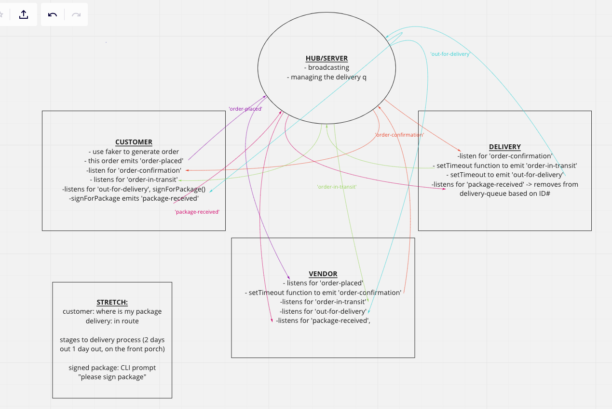

# Socket.io Partner Lab

## Authors: Dar-Ci Calhoun & Taylor Thornton
This is an exploratory socket.io project that consists of one server and three clients. This project deep dives into event driven programming by simulating the process between a customer order, vender receipt of an order, and delivery of an order. A storage queue is used to track current "out for delivery" orders and removed orders from storage upon receipt.

## Set Up
- Clone this repo and run npm init
- Initialize directories: 
    - Hub: npm i socket.io@2, dotenv
    - Customer: npm i socket.io-client@2, faker
    - Vendor: npm i socket.io-client@2
    - Delivery: npm i socket.io-client@2

## Resources
This is an iteration of previous class labs.

## UML
